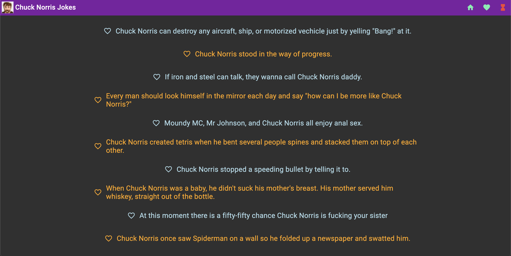
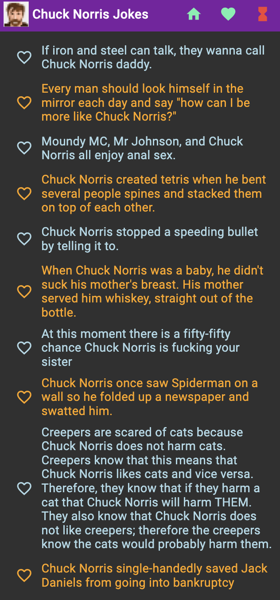

# ChuckNorrisJokeGenerator

Live GitHub Pages CD Deployment:  
https://ronancodes.github.io/chuck-norris-joke-generator/

## CI / CD

- CI is done through GitHub Actions which runs the lint, test, and build commands; then bumps the patch version and uploads the artefact to the Repo.
- The last stage of the CI job is the CD step which deploys the artefact to GitHub Pages where it's live to view.

## Tech Stack

- Angular v17
  - Control Work Flow Syntax in templates for for loops and if / else statements: https://medium.com/@bhargavr445/angular-17-new-control-work-flow-if-else-if-else-and-for-6e8a1f369693
- ESLint: https://blog.stackademic.com/how-to-setup-eslint-and-prettier-in-an-angular-project-82065799bc00
- Mat Icons: https://www.angularjswiki.com/angular/angular-material-icons-list-mat-icon-list/
- Angular Material: https://material.angular.io
- CI/CD templates:
  - JamesIves/github-pages-deploy-action@4.1.5
  - phips28/gh-action-bump-version@v11.0.4

## Code Reviews Tips to Implement

- [] Put colors in a common stylesheet, and reference using CSS4 root variables
- [] Have a theme switcher to allow switching to light mode
- [] Cache the npm ci command in GH Actions
- [] Don't use TestBed in services as it's not needed and slows down test runs
- [] enums compile to a lot of JS code, consider just exporting const's, or a class with const's in it
- [] Use RxJS instead of SetInterval for better readability and simpler code

## Future Enhancements

- [] Simplifying logic by moving from RxJS to Signals (where applicable)
- [] Custom directives
- [] Custom pipes
- [] Moving more logic from the template to the class
- [] Moving some logic from components to utility classes
- [] Integrating FireBase DB (with icon to enable or disable this syncing)
- [] Refresh icon
- [] Media breakpoint for a burger menu if the toolbar gets too crowded
- [] More CSS styling (check out this example which has Pokemon font: https://th3n3rd.medium.com/consuming-chuck-norris-api-from-reactjs-f6b395c80a8f)

# NG Default

This project was generated with [Angular CLI](https://github.com/angular/angular-cli) version 17.3.6.

## Development server

Run `ng serve` for a dev server. Navigate to `http://localhost:4200/`. The application will automatically reload if you change any of the source files.

## Code scaffolding

Run `ng generate component component-name` to generate a new component. You can also use `ng generate directive|pipe|service|class|guard|interface|enum|module`.

## Build

Run `ng build` to build the project. The build artifacts will be stored in the `dist/` directory.

## Running unit tests

Run `ng test` to execute the unit tests via [Karma](https://karma-runner.github.io).

## Running end-to-end tests

Run `ng e2e` to execute the end-to-end tests via a platform of your choice. To use this command, you need to first add a package that implements end-to-end testing capabilities.

## Further help

To get more help on the Angular CLI use `ng help` or go check out the [Angular CLI Overview and Command Reference](https://angular.io/cli) page.
